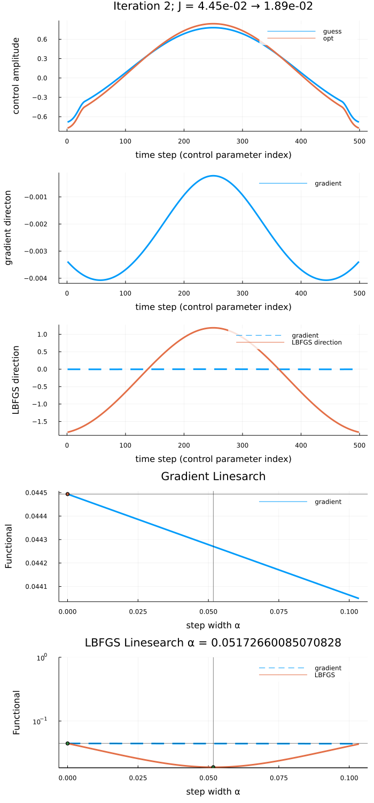

# GRAPELinesearchAnalysis.jl

A package to analyze and debug [Optim.jl](https://github.com/JuliaNLSolvers/Optim.jl)/[LBFGS](https://julianlsolvers.github.io/Optim.jl/stable/#algo/lbfgs/) linesearch behavior inside [GRAPE.jl](https://github.com/JuliaQuantumControl/GRAPE.jl).

The package allows to explore how the value of the functional varies both in the direction of the gradient and in the search direction chosen by LBFGS for different step widths, around the step width α chosen by Optim.jl.

## Installation

The `GRAPELinesearchAnalysis` package is not registered. Thus, you can only install it from Github

## Usage

The package is designed to be used as an `info_hook` for a [GRAPE.jl](https://github.com/JuliaQuantumControl/GRAPE.jl) optimization. For example,

~~~
using GRAPELinesearchAnalysis

opt_result = optimize_grape(
        problem,
        info_hook=GRAPELinesearchAnalysis.plot_linesearch(@__DIR__),
)
~~~

will produce a set of images in the folder containing the script, one per iteration. For example:

This images analyzes the linesearch in a particular iteration of the optimization. The top panel shows the guess and the optimized pulse for that iteration. The second panel shows the gradient, which would be the update (up to a stepwidth α determined by linesearch) in a first-order gradient ascent. The third panel shows the search direction determined by LBFGS, in comparison to the gradient. The LBFGS search direction is the gradient [scaled by the inverse of the approximate Hessian](https://julianlsolvers.github.io/Optim.jl/stable/#algo/lbfgs/).

The fourth panel shows how the value of the function would change in the direction of the gradient for different step width α.

Finally the bottom panel shows the same information for the LBFGS search direction, in comparison to the gradient. The initial value of the functional (α=0), i.e. J_T for the guess pulse, is indicated by a bullet in the bottom two panels. Also, the value of the functional and the step width α that was LBFGS actually chose are also indicated by a bullet in the bottom panel.
