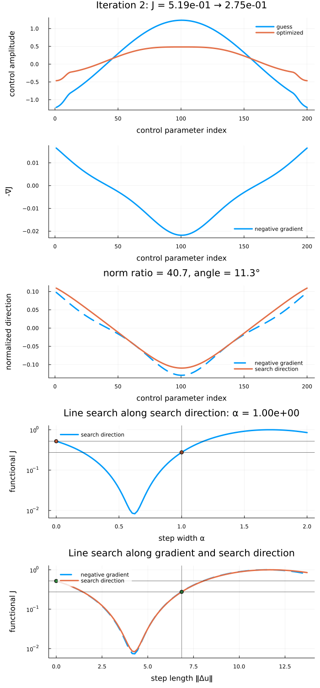

# GRAPELinesearchAnalysis.jl

A package to analyze the line search in each iteration of an optimization with [GRAPE.jl](https://github.com/JuliaQuantumControl/GRAPE.jl).

For every iteration, it plots how the optimization functional varies along the search direction chosen by the optimizer, and along the negative gradient, around the step width α that the line search accepted. This works with the default [LBFGSB.jl](https://github.com/Gnimuc/LBFGSB.jl) optimizer and with first-order optimizers from [Optim.jl](https://github.com/JuliaNLSolvers/Optim.jl), e.g., [`Optim.LBFGS`](https://julianlsolvers.github.io/Optim.jl/stable/algo/lbfgs/). The plots are useful for tuning the line search of the optimizer.

## Installation

Install the package with

~~~
] add GRAPELinesearchAnalysis
~~~

The package relies on functions of GRAPE that are only stable within bugfix releases. Therefore, each release of `GRAPELinesearchAnalysis` supports a single minor version of GRAPE. Version 0.8 requires GRAPE 1.2.

## Usage

The package provides a `callback` for a [GRAPE.jl](https://github.com/JuliaQuantumControl/GRAPE.jl) optimization. For example,

~~~julia
using QuantumControl
using QuantumControl.Functionals: J_T_sm
using GRAPE
using GRAPELinesearchAnalysis
import Optim

ϵ(t) = 0.2 * QuantumControl.Shapes.flattop(t, T = 5, t_rise = 0.3, func = :blackman)
H = hamiltonian(ComplexF64[-0.5 0; 0 0.5], (ComplexF64[0 1; 1 0], ϵ))
tlist = collect(range(0, 5, length = 201))
trajectories = [Trajectory(ComplexF64[1, 0], H; target_state = ComplexF64[0, 1])]
problem = ControlProblem(trajectories, tlist; iter_stop = 3, prop_method = :expprop, J_T = J_T_sm)

result = optimize(
    problem;
    method = GRAPE,
    optimizer = Optim.LBFGS(),
    callback = GRAPELinesearchAnalysis.plot_linesearch(joinpath(@__DIR__, "linesearch")),
)
GRAPELinesearchAnalysis.print_ls_table(result)
~~~

writes the images `linesearch-001.png`, `linesearch-002.png`, and `linesearch-003.png` to the `linesearch` subfolder of the folder that contains the script, one image per iteration. It then prints a table of the norm of the gradient, the norm of the search direction, the ratio of the two norms, the angle between the negative gradient and the search direction, and the step width α in each iteration:

~~~
  iter    |grad|  |search|     ratio  angle(°)    step α
     1  8.52e-02  8.52e-02  1.00e+00      0.00  1.25e+02
     2  1.68e-01  6.85e+00  4.07e+01     11.30  1.00e+00
     3  1.89e-01  3.70e+00  1.96e+01      2.99  1.00e+00
~~~

The `plot_linesearch` function takes the following keyword arguments:

* `samples=100`: The number of step widths α for which to evaluate the functional, along each of the two directions. Each sample requires a full propagation of all trajectories.
* `verbose=false`: Whether to show a message for each image that is written. Setting the environment variable `GRAPE_LINESEARCH_ANALYSIS_VERBOSE=1` changes the default to `true`.
* `use_current_backend=false`: Whether to create the plots with the active [Plots backend](https://docs.juliaplots.org/stable/backends/). By default, the plots are created with the GR backend, and the active backend is restored afterwards. Setting the environment variable `GRAPE_LINESEARCH_ANALYSIS_USE_CURRENT_BACKEND=1` changes the default to `true`.
* `rtol=1e-8`: The relative tolerance for checking whether the pulse update is along the search direction.

Any other keyword arguments are passed to the plotting functions of each panel, e.g., `linewidth=1`.

The callback does not affect the optimization: after sampling the functional, it restores the GRAPE workspace to its state for the optimized pulses of the iteration.

## Reading the plots

The image for the second iteration of the above example looks like this:

The top panel shows the guess and the optimized pulse values of the iteration. The second panel shows the negative gradient of the functional for the guess pulse. A first-order gradient descent would update the pulses along this direction. The third panel compares the shape of the negative gradient with that of the search direction of the optimizer, both normalized. For L-BFGS, the search direction is the gradient [scaled by the inverse of the approximate Hessian](https://julianlsolvers.github.io/Optim.jl/stable/algo/lbfgs/). The title shows the ratio of the norms of the search direction and the gradient, and the angle between them.

The fourth panel shows the functional `J` along the search direction, for step widths between 0 and twice the step width α that the line search accepted. Here, `J` is the full functional that the optimizer minimizes, including any running costs. The two bullets mark `J` for the guess (α = 0) and for the optimized pulses of the iteration.

The bottom panel shows `J` along the search direction and along the negative gradient as a function of the step length (the norm of the pulse update), so that the two directions can be compared at the same distance from the guess.

In the example, the minimum along the search direction is near α = 0.6, where `J` would drop to about 0.01. The default line search of `Optim.LBFGS` (`LineSearches.HagerZhang` with the initial guess α = 1) accepts α = 1, since that step satisfies the Wolfe conditions, and ends the iteration with `J` = 0.28. The `alphaguess` and `linesearch` parameters of the optimizer change this behavior, e.g.,

~~~julia
import LineSearches

optimizer = Optim.LBFGS(; alphaguess = LineSearches.InitialQuadratic())
~~~

or `LineSearches.InitialHagerZhang()` or `LineSearches.InitialPrevious()` for `alphaguess`. Which choice works best depends on the problem. For the above example, `InitialQuadratic` reaches `J_T < 10⁻³` in three iterations, compared to four iterations with the default, and the other two choices need more iterations. The plots show directly whether the line search finds the minimum along the search direction.

For optimizers that do not update the pulses along the search direction reported by GRAPE (e.g., `Optim.ConjugateGradient` or `Optim.Adam`), the plots use the pulse update Δu of the iteration in place of the search direction, with α = 1 for the actual update. The callback shows a warning the first time this happens.
